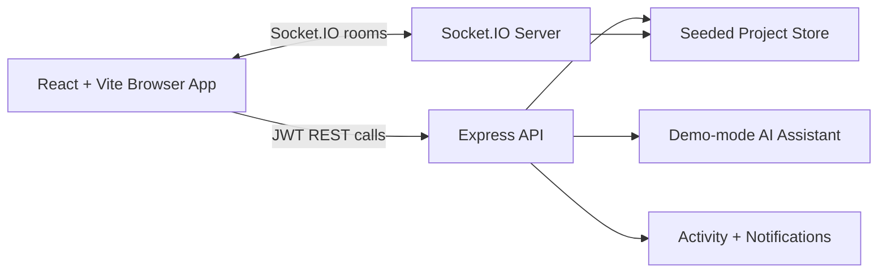

# DevCollab

DevCollab is a real-time project operating system for student developer teams, built for DevFusion 2.0 Round 3 at IIT Bombay. It combines Kanban task tracking, project wiki pages, reusable code snippets, live presence, mention notifications, activity history, and AI-assisted project/code review workflows in one submission-ready MVP.

## Submission Links

- Live frontend: https://pimrankhan67890-lang.github.io/DevFusion-2.O/
- Backend health: _optional Node backend deployment URL ending with `/health`_
- Demo video: _add uploaded 3-5 minute demo video URL_
- GitHub repository: _add public repository URL_

## Demo Credentials

```text
Email: imran@devcollab.demo
Password: DevCollab@123
```

Additional seeded users:

```text
trivikram@devcollab.demo / DevCollab@123
riya@devcollab.demo / DevCollab@123
```

## Features

- Authentication with seeded judge demo accounts.
- Workspace and project dashboard with team roles.
- Kanban board with task creation, status movement, priorities, comments, and assignees.
- Real-time task updates and live project presence using Socket.IO.
- Mention notifications for comments such as `@trivikram` or `@riya`.
- Project wiki with editable pages and version history.
- Code snippet manager with search, tags, language labels, and copy action.
- AI project assistant for summary, blockers, standup, and task breakdown.
- AI code reviewer with score, risk notes, and improvement suggestions.
- Activity feed for major project actions.
- Free/Pro sandbox upgrade simulation.
- Responsive, light UI designed for judging demos.

## Tech Stack

- Frontend: React, Vite, Tailwind CSS, lucide-react.
- Backend: Node.js, Express, Socket.IO, JWT auth, bcrypt password hashing.
- Data mode: seeded in-memory backend store for deterministic judging, plus browser-only GitHub Pages demo mode so the free static live link remains functional without a Node server.
- AI: deterministic demo-mode responses. This keeps the app fully functional without requiring a private API key during judging.
- Deployment target: Vercel frontend and Render backend.

## Architecture



Every backend project mutation writes an activity entry. Comments are scanned for mentions, and matching users receive notifications. Connected clients join `project:{projectId}` Socket.IO rooms to receive task, comment, activity, notification, and presence updates without refreshing. On GitHub Pages, the same UI runs in browser-only demo mode because GitHub Pages hosts static files only.

## Local Setup

```bash
npm install
npm run dev
```

Frontend runs on `http://localhost:5173`.
Backend runs on `http://localhost:8080`.

Run a backend smoke test:

```bash
npm run test:smoke
```

Build frontend:

```bash
npm run build
```

Preview the production build locally:

```bash
npm run preview:static
```

## Environment Variables

Copy `.env.example` and configure deployment values.

```text
PORT=8080
CLIENT_URL=http://localhost:5173
JWT_SECRET=replace-with-strong-secret
VITE_API_URL=http://localhost:8080
```

Optional production AI keys can be added later. The submitted MVP works without them using deterministic demo-mode AI.

## Deployment Notes

### Backend on Render

- Root directory: `backend`
- Build command: `npm install`
- Start command: `npm start`
- Required env vars:
  - `PORT`
  - `CLIENT_URL`
  - `JWT_SECRET`

### Frontend on Vercel

- Framework preset: Vite
- Root directory: `frontend`
- Build command: `npm run build`
- Output directory: `dist`
- Required env var:
  - `VITE_API_URL=https://your-render-backend-url`

### Free GitHub Pages Live Link

This repository includes `.github/workflows/deploy-pages.yml`. After pushing to GitHub:

1. Open repository Settings.
2. Go to Pages.
3. Set source to GitHub Actions.
4. Run or wait for the `Deploy GitHub Pages` workflow.
5. Live URL: `https://pimrankhan67890-lang.github.io/DevFusion-2.O/`

GitHub Pages cannot run the Node/Socket.IO backend. The Pages deployment uses browser-only demo mode so judges can still test the product flow from the live link. For true multi-user realtime across devices, deploy `backend` on Render and set `VITE_API_URL` for a Vercel frontend.

## AI and Library Disclosure

DevCollab uses open-source libraries including React, Vite, Tailwind CSS, Express, Socket.IO, JWT, bcryptjs, and lucide-react. AI features use deterministic demo-mode responses in this repository so the app remains reliable without paid API keys. A production version can replace `backend/src/ai.js` with Gemini, OpenAI, or Anthropic API calls.
